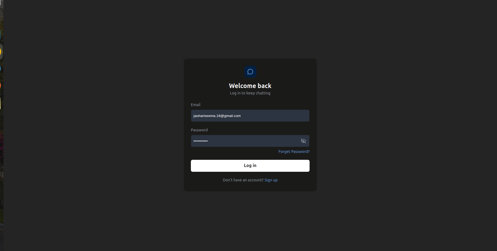
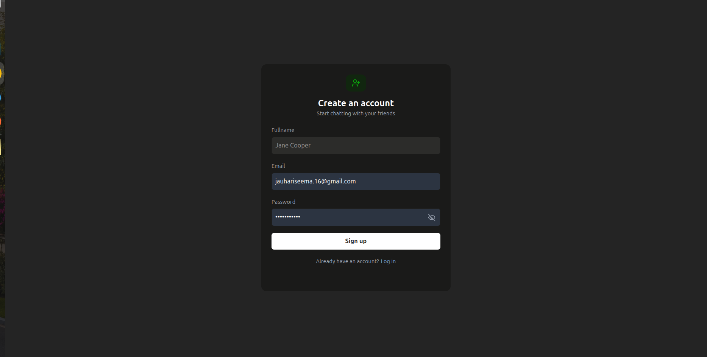
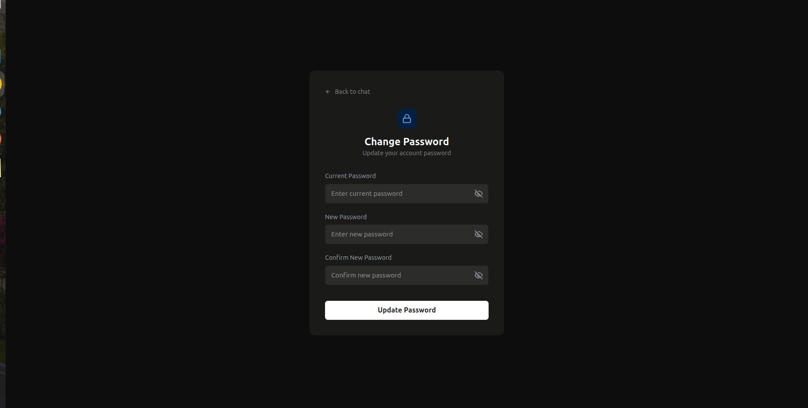
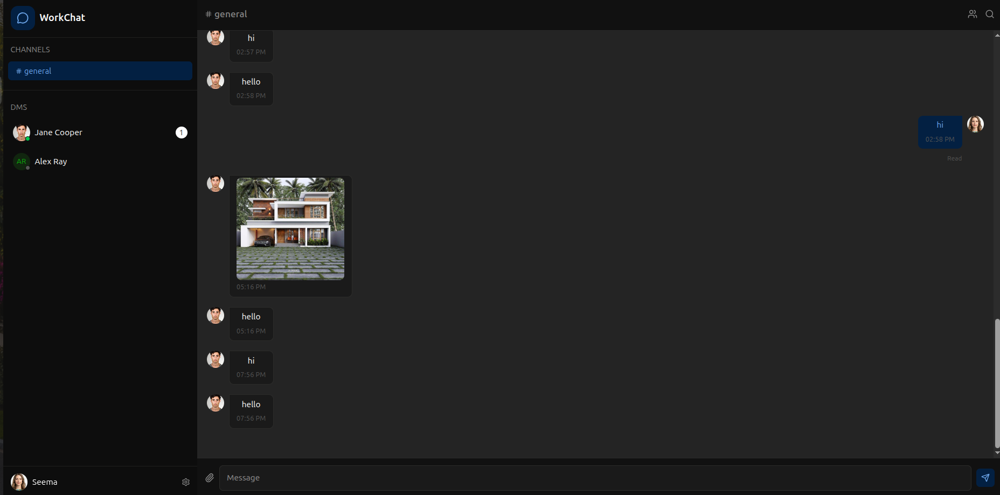

# WorkChat — Real-Time Messaging Infrastructure

A production-grade Slack-style chat application built with NestJS, React, Socket.IO, MongoDB, and Redis. Demonstrates real-time WebSocket clustering, presence systems, message delivery guarantees, and cursor-based pagination.

## Screenshots

| Login | Register |
|---|---|
|  |  |

| Change Password | Update Profile |
|---|---|
|  |  |

**Real-time chat**



## Tech Stack

| Layer | Technology |
|---|---|
| Frontend | React 19, TypeScript, Tailwind CSS v4, Vite |
| Backend | NestJS, TypeScript |
| Real-time | Socket.IO, Redis pub/sub |
| Database | MongoDB + Mongoose |
| Auth | JWT (access + refresh token rotation) |
| Cache/Presence | Redis (ioredis) |
| Email | Nodemailer (Gmail SMTP) |
| Validation | class-validator (backend), Zod + React Hook Form (frontend) |

## Architecture

```
React Client <-> Vite Proxy -> NestJS (Socket.IO Gateway + REST API)
                                    |
                          MongoDB (messages, rooms, users)
                          Redis (presence set + pub/sub + token blacklist)
```

## Features

- JWT authentication with access + refresh token rotation
- Token blacklisting on logout via Redis
- WebSocket gateway with JWT handshake validation
- Real-time messaging via Socket.IO rooms
- Online presence tracking via Redis Set + pub/sub
- Multi-instance WebSocket broadcasting via Redis pub/sub
- Typing indicators (per-room)
- Read receipts
- Cursor-based message pagination (scroll up to load history)
- Channel (group) + DM messaging
- User search
- Forgot password via email
- Change password + update profile
- Auto-join default channels on register
- Responsive UI (mobile sidebar drawer)

## Project Structure

```
chat-api/                   # NestJS backend
  src/
    auth/                   # JWT auth, refresh tokens, password reset
    users/                  # User schema, search
    rooms/                  # Channel + DM management
    messages/               # Message CRUD + pagination
    gateway/chat/           # Socket.IO WebSocket gateway
    redis/                  # Redis service (presence, pub/sub, blacklist)
    mail/                   # Email service (Nodemailer)
    common/                 # Guards, filters, middleware, decorators

client/                     # React frontend
  src/
    api/                    # Axios instance + interceptors
    context/                # UserContext (auth state)
    hooks/                  # useAuthGuard, useTokenRefresh
    pages/                  # Login, Register, ChatRoom, ChangePassword, etc.
    routes/                 # ProtectedRoute, PublicRoute
    sockets/                # Socket.IO client instance
```

## Database Design

```js
// users
{ _id, name, email, password_hash, roles, resetToken, resetTokenExpiry }

// rooms
{ _id, type: 'channel'|'dm', name, members[], created_by, last_message, last_activity }

// messages
{ _id, room_id, sender_id, content, read_by[], createdAt }
```

## WebSocket Events

| Event | Direction | Description |
|---|---|---|
| `join_room` | Client → Server | Join a room |
| `send_message` | Client → Server | Send a message |
| `receive_message` | Server → Client | Broadcast new message |
| `typing_start` | Client → Server | User started typing |
| `typing_stop` | Client → Server | User stopped typing |
| `user_typing` | Server → Client | Someone is typing |
| `user_stop_typing` | Server → Client | Someone stopped typing |
| `mark_read` | Client → Server | Mark room messages as read |
| `messages_read` | Server → Client | Notify sender messages were read |
| `get_online_users` | Client → Server | Request online users snapshot |
| `user_online` | Server → Client | User came online |
| `user_offline` | Server → Client | User went offline |

## REST API

```
POST   /auth/register
POST   /auth/login
POST   /auth/refresh
GET    /auth/verify-token
DELETE /auth/logout
POST   /auth/forgot-password
POST   /auth/reset-password
POST   /auth/change-password

GET    /users/search?query=

GET    /rooms/recent/channels
POST   /rooms/recent/dms
POST   /rooms/dm
GET    /rooms/:id/messages?cursor=&limit=20
```

## Getting Started

### Prerequisites

- Node.js v20+
- Docker + Docker Compose (for MongoDB + Redis)
- Gmail account with App Password (for email)

### Environment Variables

Create `.env` in `chat-api/`:

```
# App
PORT=3000
FRONTEND_URL=http://localhost:5173

# Database
DATABASE_URI=mongodb://localhost:27017/real_time_chat

# Redis
REDIS_URL=redis://localhost:6379

# JWT
JWT_SECRET=your_jwt_secret
JWT_EXPIRY=15m

# Email
SMTP_USER=your@gmail.com
SMTP_PASS=your-app-password
```

Create `.env` in `client/`:

```
API_URL=http://localhost:3000
```

### Run with Docker

```bash
# Start MongoDB + Redis
docker compose up -d mongodb redis

# Backend
cd chat-api
npm install
npm run start:dev

# Frontend
cd client
npm install
npm run dev
```

### Seed Default Channels

Default channels (`general`) are seeded automatically on app startup via `onModuleInit`.

## Key Technical Concepts

**Cursor-based pagination** — uses `_id` as cursor instead of page numbers. New real-time messages don't shift historical pages, preventing duplicate/missing messages on scroll.

**Redis pub/sub for multi-instance broadcasting** — when running multiple server instances, Socket.IO connections are spread across instances. Redis pub/sub ensures a message received on Server 1 is broadcast to clients connected to Server 2.

**JWT on WebSocket handshake** — token is validated once on connection via `client.handshake.auth.token`. User data is attached to `client.data.user` for all subsequent events without re-validating each event.

**Token blacklist** — on logout, access token is SHA-256 hashed and stored in Redis with the same TTL as the token. JWT guard checks blacklist before allowing any request.

**Proactive presence** — user online/offline status stored in Redis Set. On connect/disconnect, status is published to `user_status` channel. All server instances subscribe and broadcast to their connected clients.

## Resume Impact

> Real-time messaging infrastructure handling presence, delivery guarantees, and multi-instance WebSocket clustering via Redis pub/sub. Implemented cursor-based pagination, JWT token rotation with Redis blacklisting, and per-room typing indicators.

## Interview Topics Covered

- WebSocket vs polling vs SSE
- How to scale WebSocket servers (Redis adapter / pub/sub)
- Message ordering guarantees
- Cursor pagination vs offset pagination
- Distributed presence at scale
- JWT refresh token rotation + revocation
- Redis data structures (Set, pub/sub, String with TTL)